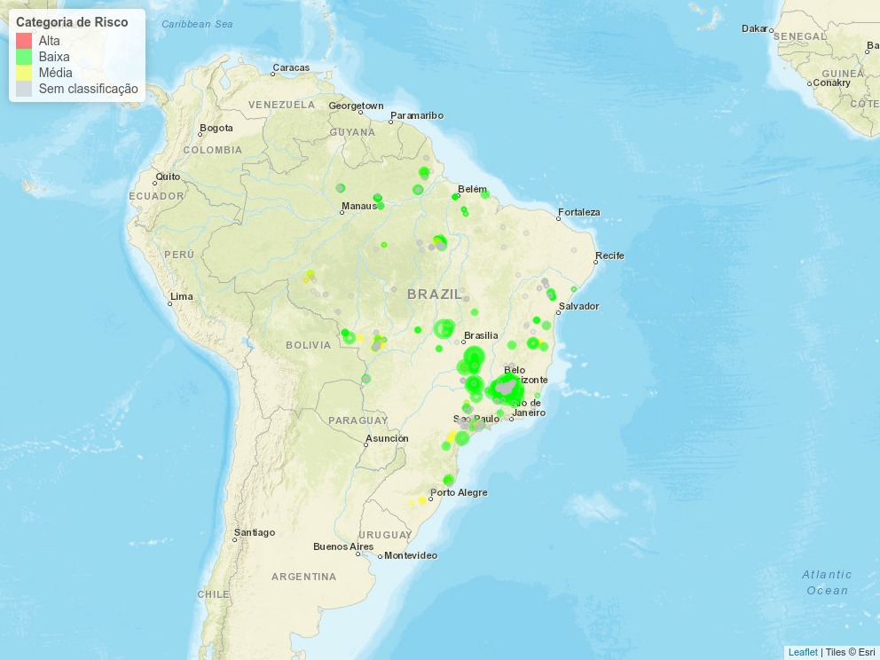

# mapa-riscos-barragens-br
Projeto para análise do risco das barragens no Brasil a partir de dados públicos.

Para executar o código instale o 'R' e 'RStudio'. No linux utilize os comandos abaixo:

```shell
sudo apt-get install r-base r-base-dev
sudo apt-get install texlive-full
sudo apt-get install libxml2-dev libcurl4-openssl-dev libssl-dev libgdal-dev libudunits2-dev libfreetype6 libfreetype6-dev libfontconfig1 libfontconfig1-dev libxft-dev
```
O RStudio pode ser obtido [aqui](https://www.rstudio.com/products/rstudio/download/).

Categoria de risco x altura atual das barragens:


